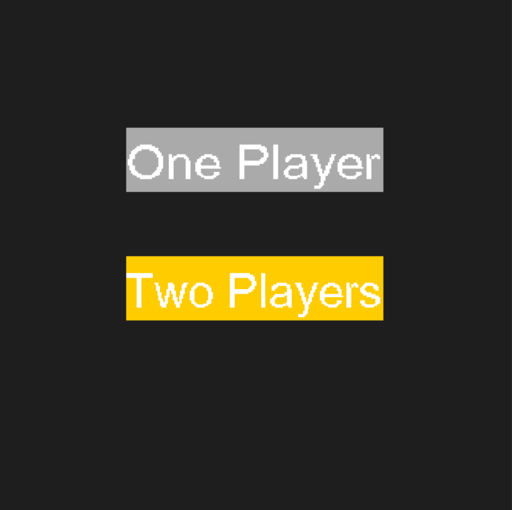
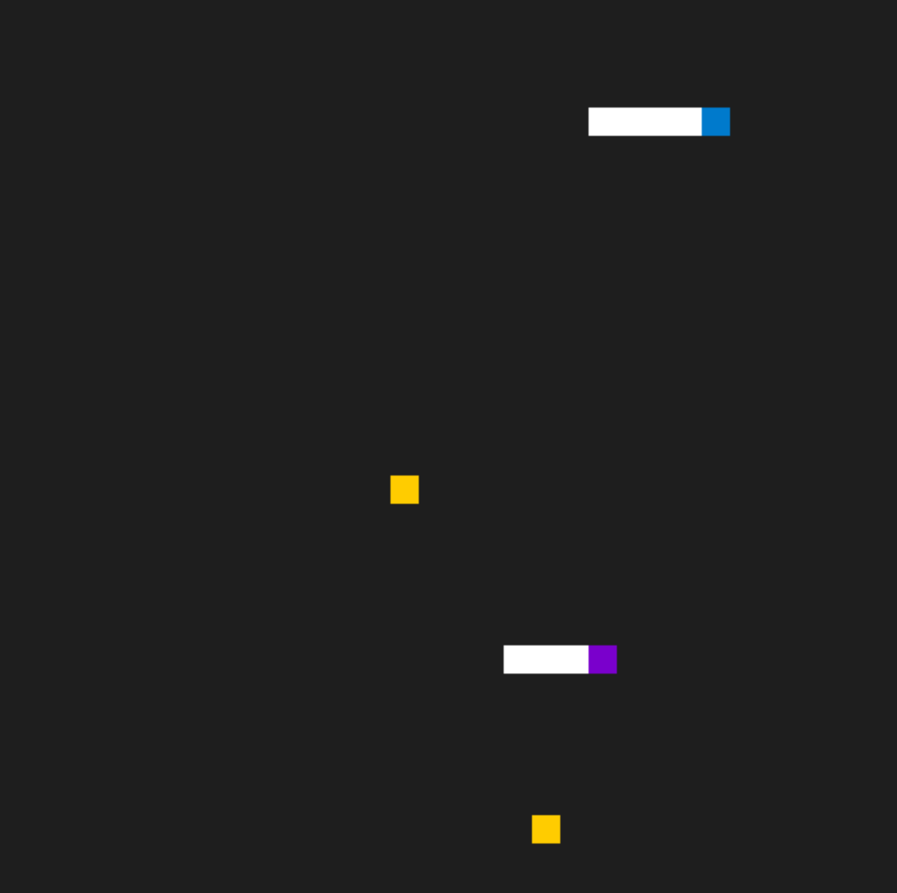

# CPPND: Capstone Snake Game: Two Players

This is a the Capstone project in the [Udacity C++ Nanodegree Program](https://www.udacity.com/course/c-plus-plus-nanodegree--nd213). This project extends the original starter project to allow two players to play at the same time. The orignal starter project can be found [here]. (https://github.com/udacity/CppND-Capstone-Snake-Game)

## Menu: To Select One or Two Players



## Playing: Two Snakes in "Two Players" Mode



## How to Play?

When the program starts, a menu will shown and you have choose one the the following mode:

### 1. One Player Mode

- Use `←`(left) `↑`(up)　`→`(right)　`↓`(down) to control the snake

### 2. Two Players Mode

1. `User1`: Use `←`(left) `↑`(up)　`→`(right)　`↓`(down) to control the snake
2. `User2`: Use `A`(left) `W`(up)　`D`(right)　`S`(down) to control the snake

## Dependencies for Running Locally

- cmake >= 3.7
  - All OSes: [click here for installation instructions](https://cmake.org/install/)
- make >= 4.1 (Linux, Mac), 3.81 (Windows)
  - Linux: make is installed by default on most Linux distros
  - Mac: [install Xcode command line tools to get make](https://developer.apple.com/xcode/features/)
  - Windows: [Click here for installation instructions](http://gnuwin32.sourceforge.net/packages/make.htm)
- SDL2 >= 2.0
  - All installation instructions can be found [here](https://wiki.libsdl.org/Installation)
  - Note that for Linux, an `apt` or `apt-get` installation is preferred to building from source.
- SDL2TTF >= 2.0
  - All installation instructions can be found [here](https://www.libsdl.org/projects/SDL_ttf/docs/SDL_ttf.html)
- gcc/g++ >= 5.4
  - Linux: gcc / g++ is installed by default on most Linux distros
  - Mac: same deal as make - [install Xcode command line tools](https://developer.apple.com/xcode/features/)
  - Windows: recommend using [MinGW](http://www.mingw.org/)

## Basic Build Instructions

1. Clone this repo.
2. Make a build directory in the top level directory: `mkdir build && cd build`
3. Compile: `cmake .. && make`
4. Run it: `./SnakeGame`.

## Project Criteria

### Loops, Functions, I/O

**Rubric 1:**: The project demonstrates an understanding of C++ functions and control structures.

```
The project uses control structures to support two playiing modes at various spots. Also, many of the new features are grouped into functions such as Game::Init(), Controller::HandleMenuInput, etc.
```

**Rubric 2:** The project accepts user input and processes the input:

```
A menu is added to allow users select playing mode.
```

## Object Oriented Programming

**Rubric 3:** The project uses Object Oriented Programming techniques.

```
New features are integrated into existing classes and the modification follows the similar object-oriented design.
```

**Rubric 4:** Classes use appropriate access specifiers for class members.

```
Members added to classes are modified with appropriate access specifiers. e.g.) selected_color and not_selected_color are marked as private in renderer.h
```

**Rubric 5:** Class constructors utilize member initialization lists.

```
snake2 is added to Game class and member initialization list is used to initialize the snake2 object.
```

**Rubric 6:** Classes abstract implementation details from their interfaces.

```
Newly added methods such as Controller::HandleMenuInput and Renderer::RenderMenu perform the tasks as their names suggest and do not change program states that are not passed into it by reference.
```
